# 使用 Tencent CIAM 对 WordPress 站点进行登录保护

## 一、概述

WordPress 是国际知名的开源博客软件和内容管理系统。全球约30%的网站(7亿5000个)是使用 WordPress 架设的。由于 WordPress 具备强大的模板系统、灵活的插件机制和优秀的插件生态，很多用户不但使用它来搭建博客网站和内容管理系统，还用它来建设各类商业网站和业务系统。无论使用 WordPress 架设哪类系统，为用户提供登录认证功能都是一项基础且普遍的需求。然而，WordPress 平台自带的登录认证与用户管理功能十分有限，仅支持基于账号密码的认证方式，仅能通过邮箱、昵称等有限的属性对用户进行标识，且不具备对用户登录活动的统计分析和审计能力。

腾讯数字身份管控平台（公众版）（以下简称 Tencent CIAM），用于管理公众互联网用户的账号、注册和认证规则，打通分散的用户数据孤岛、帮助应用更好地进行用户识别与画像。

本文介绍如何使用 Tencent CIAM 对 WordPress 站点进行登录保护。读者将会看到，由于 Tencent CIAM 提供了方便、快捷的配置功能以及对互联网认证协议的标准化支持，WordPress 管理者无需编写一行代码，只需通过简单的配置操作即可实现对 WordPress 站点登录认证和用户管理能力的增强和加固。

## 二、WordPress 的默认登录功能

假设我们已经部署好了一个 WordPress 站点，其根路径是 `https://WORDPRESS.SITE`。首先我们来看看 WordPress 平台自带的用户管理和登录认证功能。

使用管理员登录后台后，可以通过左侧菜单的 `用户 -> 所有用户` 来查看 WordPress 的用户列表，以及查看用户详情、维护用户信息、重置密码。

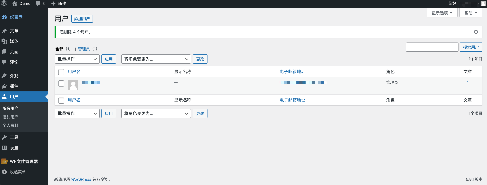

WordPress 默认的登录页面只支持账号密码认证方式。

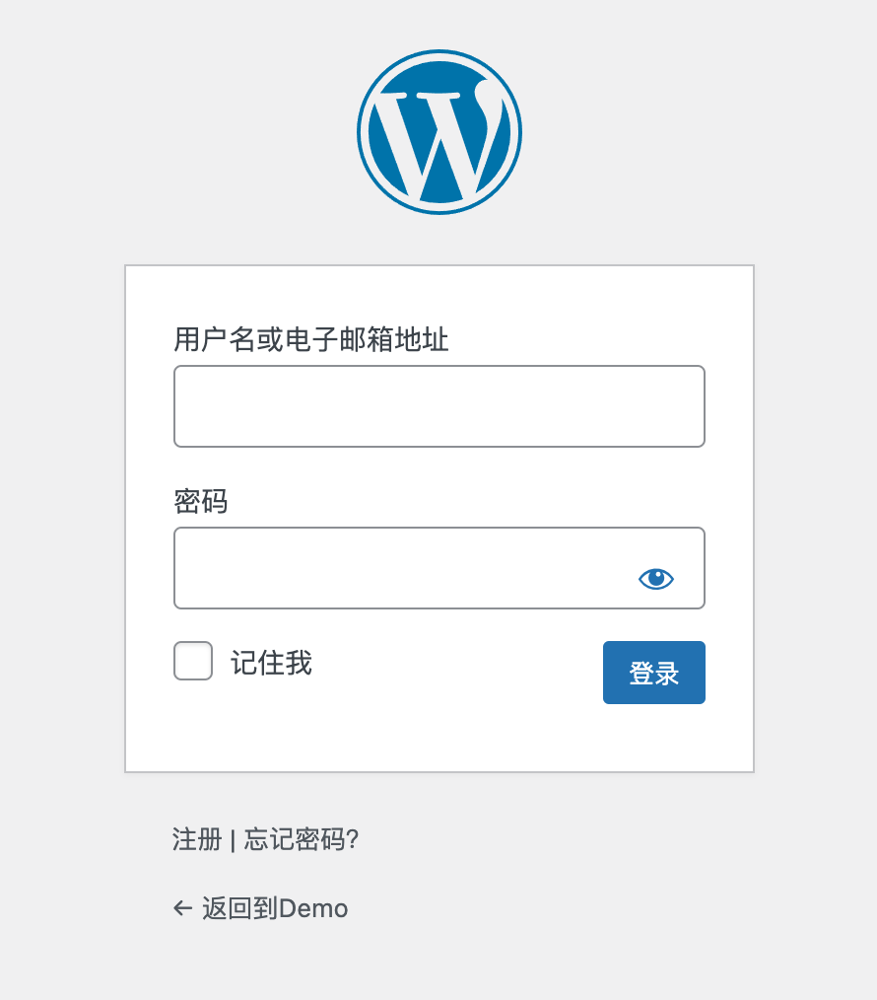

## 三、使用 Tencent CIAM 接管 WordPress 登录

Tencent CIAM 支持应用系统基于标准 OpenID Connect (OIDC) 协议接入，支持账号密码、短信OTP、邮箱OTP、微信PC扫码、微信小程序登录、支付宝登录等多种认证方式，支持用户通过表单注册或首次登录自动注册，且通过腾讯云控制台提供了便捷的界面对以上功能进行灵活的定制。

### 安装 WordPress OIDC 插件

我们的 WordPress 站点将通过标准 OIDC 协议与 Tencent CIAM 对接。因此，我们首先安装并启用 WordPress 的 OIDC 插件。在 WordPress 后台选择 `插件 -> 安装插件`，搜索并安装 `OpenID Connect Generic Client` 插件。

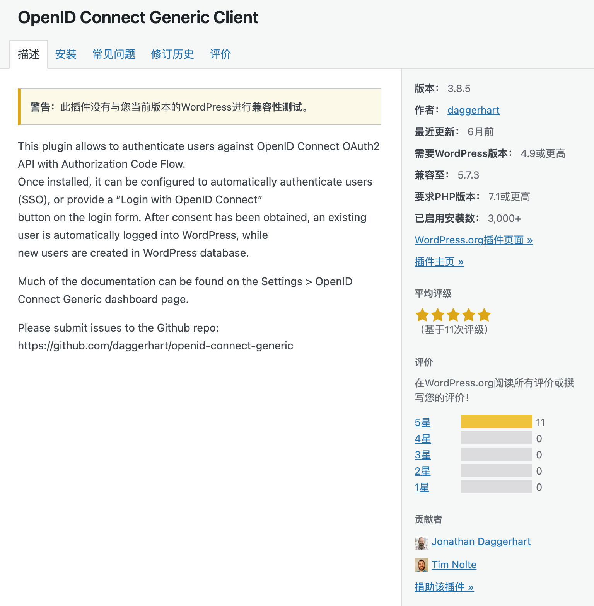

启用插件，再次访问登录页面时，发现页面上部增加了一个按钮 `Login with OpenID Connect` 。

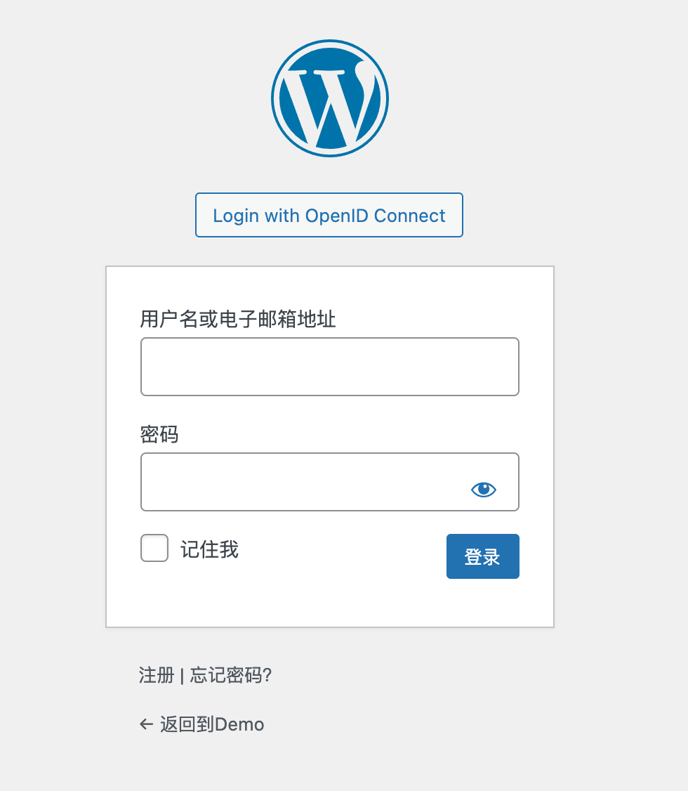

由于还未对 Tencent CIAM 进行配置，此功能暂时还不可用。接下来我们配置 CIAM 。

### 创建 Tencent CIAM 应用

Tencent CIAM 的官方网址是 [https://cloud.tencent.com/product/ciam](https://cloud.tencent.com/product/ciam)。在开始使用 Tencent CIAM 前，我们需要先登录腾讯云，开通 CIAM 服务，并在 CIAM 中创建一个用户目录。假设我们已经创建了一个域名为 `https://dev-wordpress.portal.tencentciam.com` 的用户目录（用户目录的域名可以在 CIAM 控制台 `个性化设置 -> 域名设置` 中查看到）。

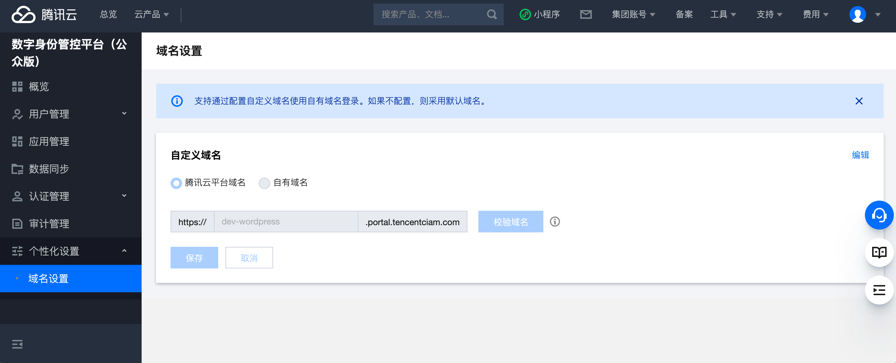

用户目录是 Tencent CIAM 的一个基础“容器”，用户的账号信息、用户访问的应用系统的相关配置、用户的认证方式等都将在用户目录中进行存储与配置。接下来，需要有一个用户目录中的应用来扮演 WordPress 站点的角色，实现 WordPress 与 Tencent CIAM 的对接。在 CIAM 的 `应用管理` 栏目中新建或使用一个现有应用，完成如下配置。

- 基本信息
  - 应用类型选择 `Web应用`
  - 根据实际情况填写应用名称、所属行业和应用描述

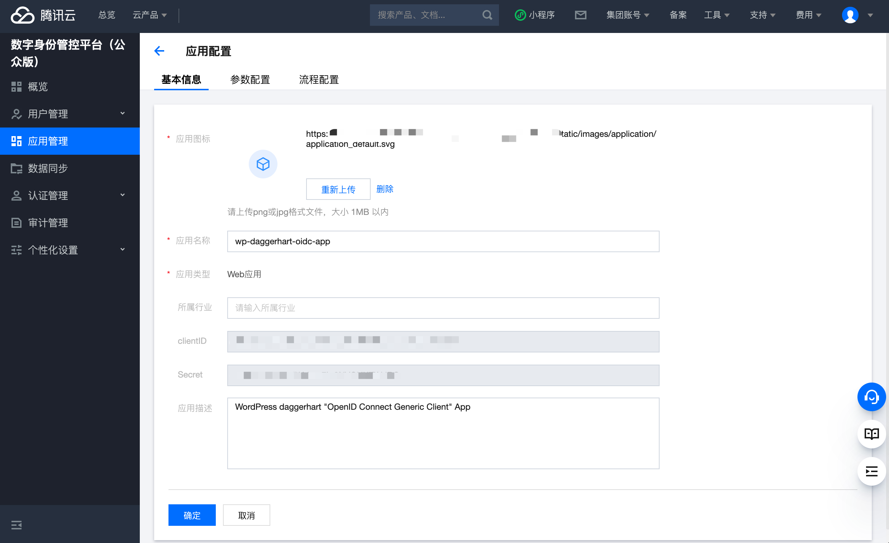

- 参数配置
  - Redirect URI 填 `https://WORDPRESS.SITE/wp-admin/admin-ajax.php?action=openid-connect-authorize`
    - > 请使用您的 WordPress 站点根路径替换 `https://WORDPRESS.SITE`。下同。
  - Logout Redirect URI 填站点根路径 `https://WORDPRESS.SITE`
  - 其他配置使用默认值

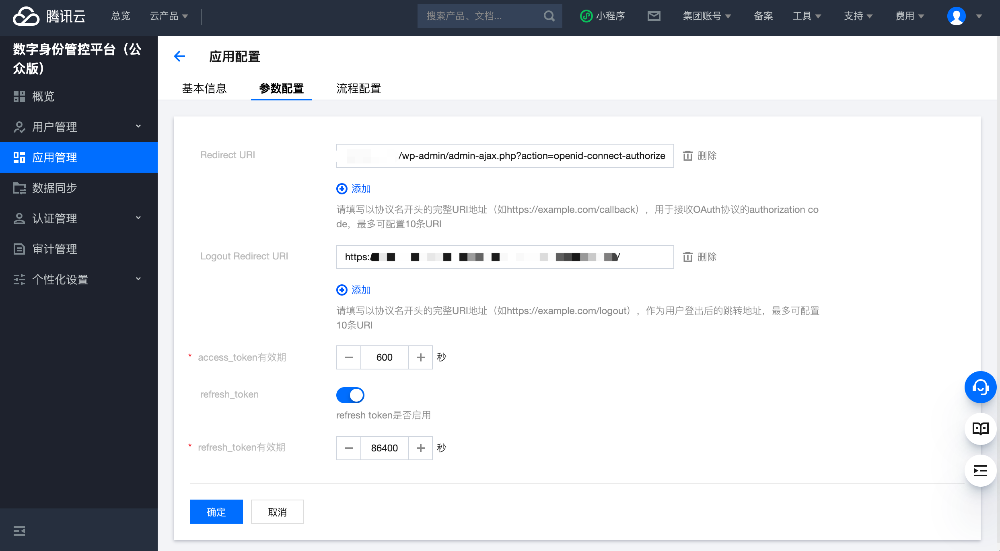

- 流程配置
  - 启用登录流程，首选认证源选择系统自带的 `账号密码认证`，关联认证源暂不设置，Claims 是用户登录成功后 CIAM 将提供给 WordPress 的用户信息字段，此处我们选择常用的 `用户昵称`、`用户名称`、 `邮箱地址` 和 `性别`。
  - 启用注册流程。认证属性选择 `邮箱地址` 和 `用户名称` ，普通属性将 `用户昵称` 作为必填项，`性别` 作为选填项。
  - 其他流程和协议管理暂时关闭。

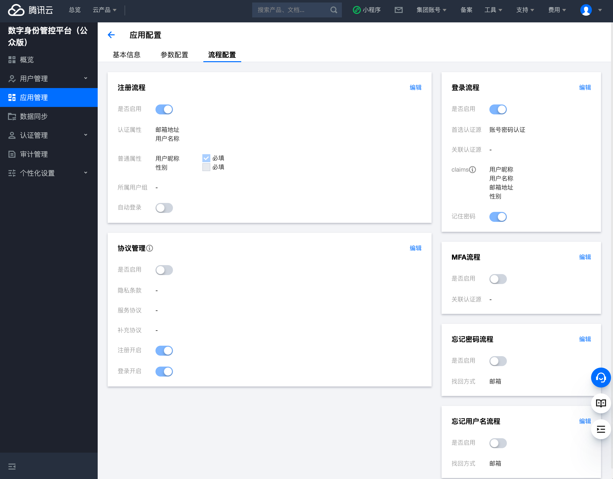

完成以上配置后，回到 `应用管理` 栏目的列表页面，启用该应用。

### 配置 WordPress OIDC 插件

接下来配置 WordPress OIDC 插件。在 WordPress 后台选择 `设置 -> OpenID Connect Client`，完成如下配置。

- Login Type 选择默认的 `OpenID Connect button on login form`
- Client ID 和 Client Secret Key 分别填入 CIAM 应用基本信息页面的 Client ID 和 Client Secret
OpenID Scope 填 `openid`
- Login Endpoint URL 填 `https://dev-wordpress.portal.tencentciam.com/oauth2/authorize`
  - > 请使用您的 CIAM 用户目录域名替换掉 `https://dev-wordpress.portal.tencentciam.com`。下同。
- Userinfo Endpoint URL 填 `https://dev-wordpress.portal.tencentciam.com/userinfo`
- Token Validation Endpoint URL 填 `https://dev-wordpress.portal.tencentciam.com/oauth2/token`
- End Session Endpoint URL 填 `https://dev-wordpress.portal.tencentciam.com/logout?client_id=CLIENT_ID&logout_redirect_uri=https://WORDPRESS.SITE`
  - 请分别使用您的 CIAM 用户目录域名、CIAM 应用 Client ID、和 WordPress 站点根路径替换以上的 `https://dev-wordpress.portal.tencentciam.com`、`CLIENT_ID` 和 `https://WORDPRESS.SITE`。
- Identity Key 填默认的 `sub`
- Nickname Key 填 `nickname`
- Email Formatting 填 `{email}`
- 其他设置使用默认值或留空。

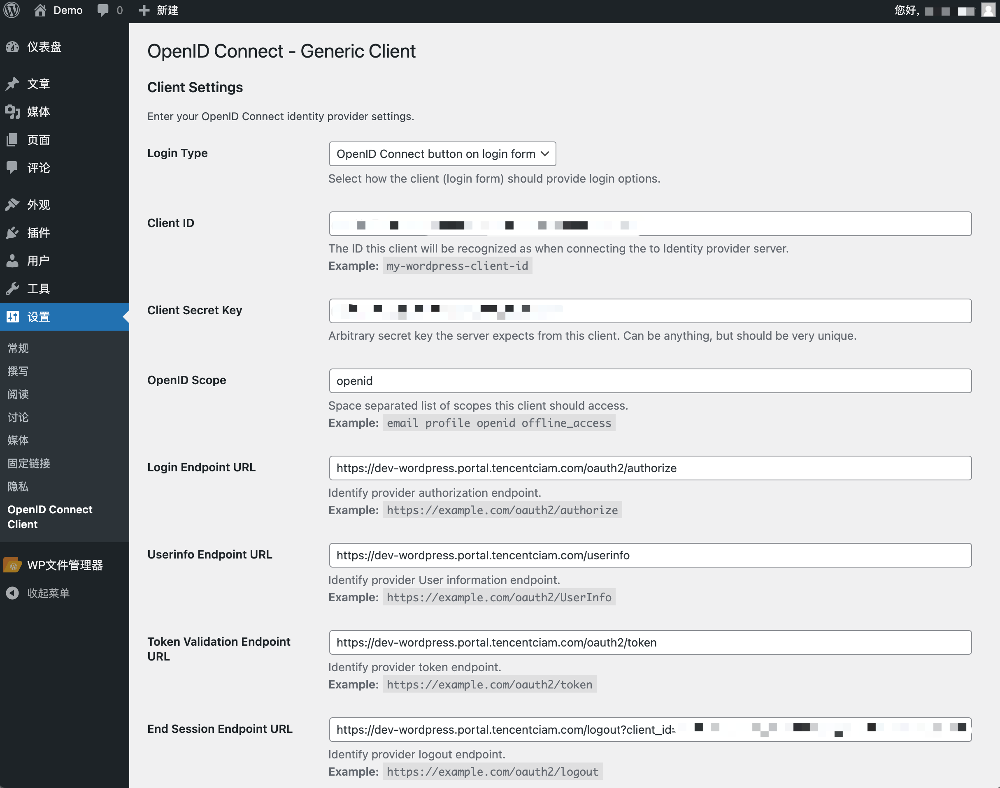

### 运行效果

至此，我们的 WordPress 站点已经可以使用 Tencent CIAM 登录了。再次访问 WordPress 登录页，点击 `Login with OpenID Connect`，在弹出的 CIAM 登录页上使用现有用户登录或注册新用户。

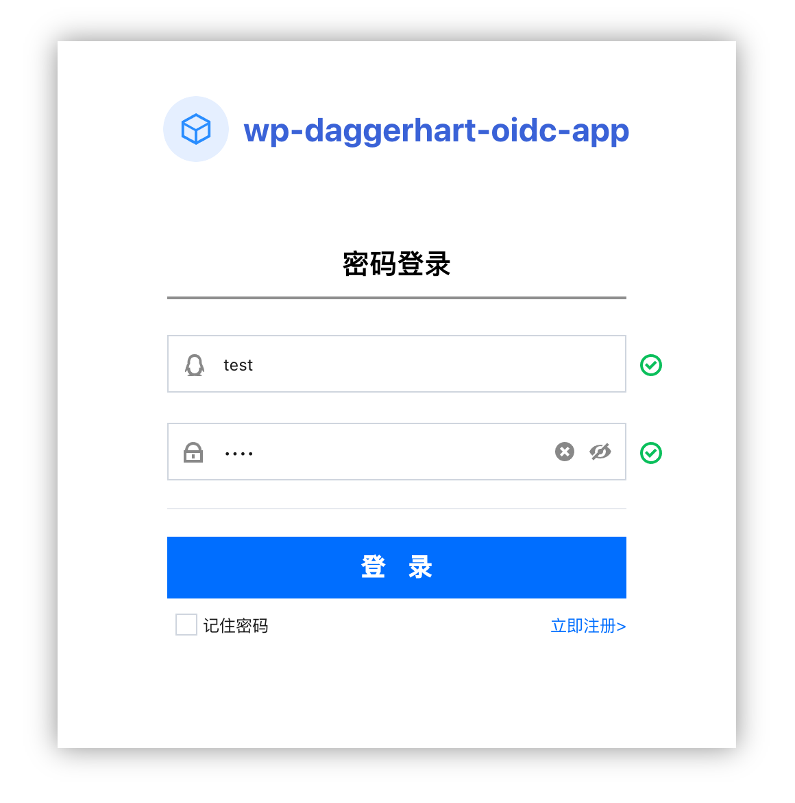

登录成功后，将自动跳转回登录前访问的 WordPress 页面。

### 查看用户信息和登录日志

使用 Tencent CIAM 接管 WordPress 登录后，我们可以在 CIAM 控制台查看已注册用户的列表、最近登录时间和用户详细信息，还可以编辑用户详情、重置用户密码或锁定、冻结、删除用户。

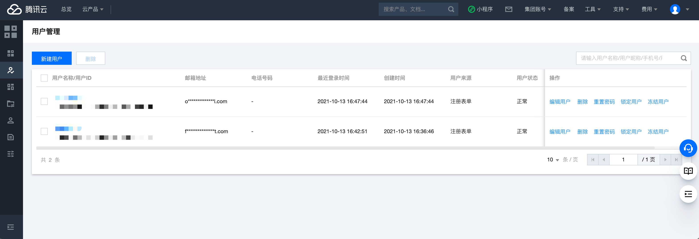

在控制台的 `审计管理` 栏目可以查看用户登录的详细情况。

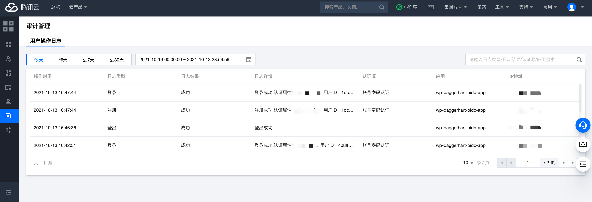

## 四、进阶使用

### 允许用户以更多方式登录

Tencent CIAM 支持用户以多种方式进行登录认证。接下来，我们为 WordPress 站点增加邮箱OTP的登录方式。

通过 CIAM 控制台的 `认证管理 -> 通用认证源 -> 新建认证源 -> 邮箱OTP认证` 来创建一个新的邮箱OTP认证源。

填写认证源基本信息

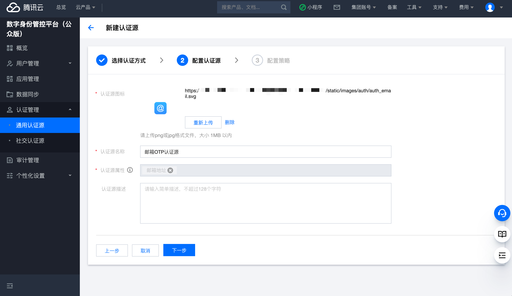

配置认证源策略

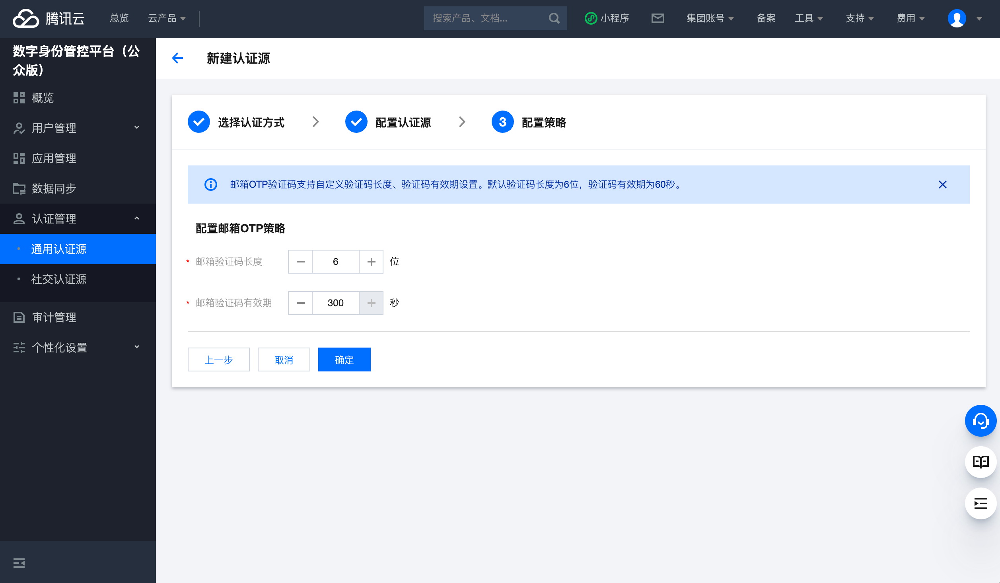

创建后，在认证源列表页面开启该认证源。

创建并开启认证源后，还需要告诉我们的 WordPress 应用来使用这个认证源。在应用列表找到 WordPress 应用，选择 `配置 -> 流程配置`，在登录流程的关联认证源中勾选刚刚创建的邮箱OTP认证源，然后点击确定。

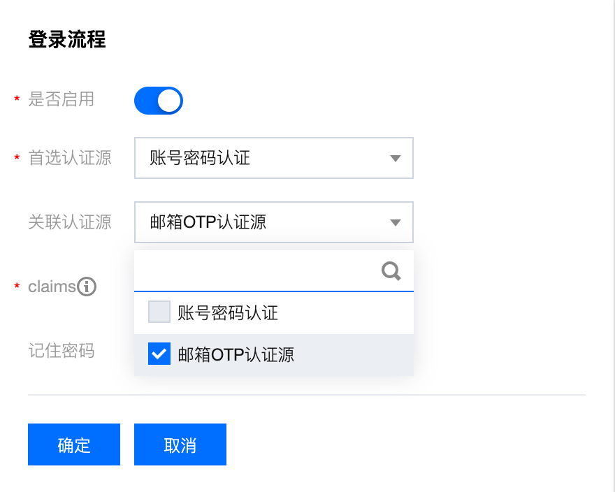

此时，再次访问 CIAM 登录页面，可以看到在原先账号密码认证的基础上新增了一个“邮箱登录”的选择。输入邮箱并点击“发送验证码”，即可通过邮箱中收到的一次性密码完成登录。

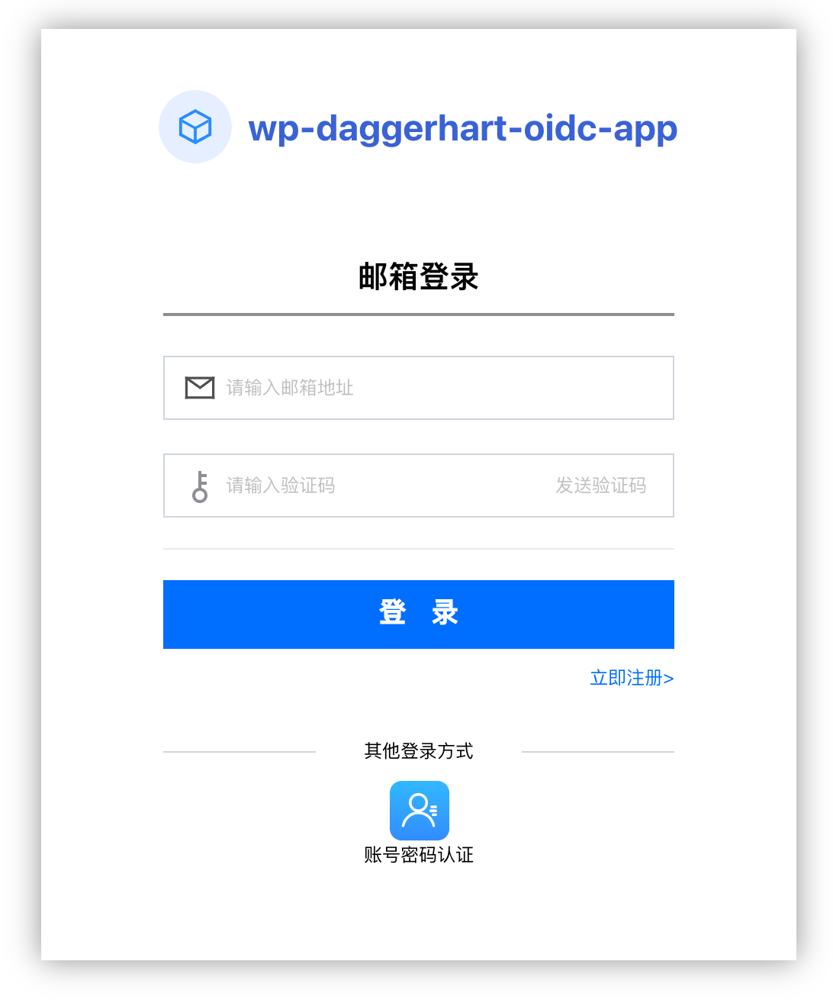

### 屏蔽 WordPress 登录页

当前，用户登录时会先访问 WordPress 的默认登录页，然后点击页面上的 `Login with OpenID Connect` 跳转到 Tencent CIAM 登录页进行登录。我们可以通过修改 WordPress OIDC 插件的配置来进一步优化用户登录体验。访问 `设置 -> OpenID Connect Client`，将第一项配置 Login Type 修改为 `Auto Login - SSO`，点击“保持更改”。

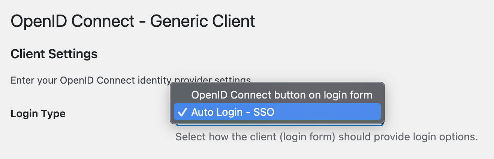

用户再次登录时，将不再显示 WordPress 登录页，而是直接显示 Tencent CIAM 登录页。

### 为 WordPress 设置全站内容登录保护

某些场景下，我们希望用户首先完成注册登录，然后才能访问 WordPress 站点的内容。可以通过勾选插件的 Enforce Privacy 配置来实现此需求。

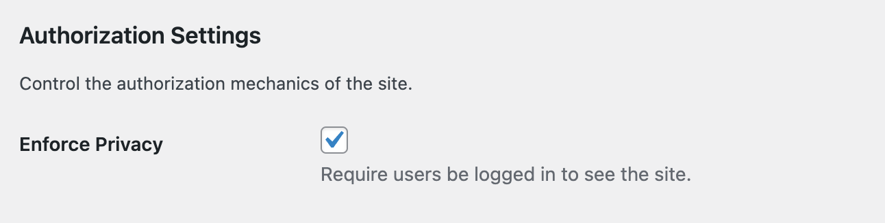

### 其他

Tencent CIAM 还支持微信登录、支付宝登录、用户数据同步、忘记用户名、忘记密码等丰富的功能，有兴趣的读者可以基于本文的内容做进一步探索实践。
